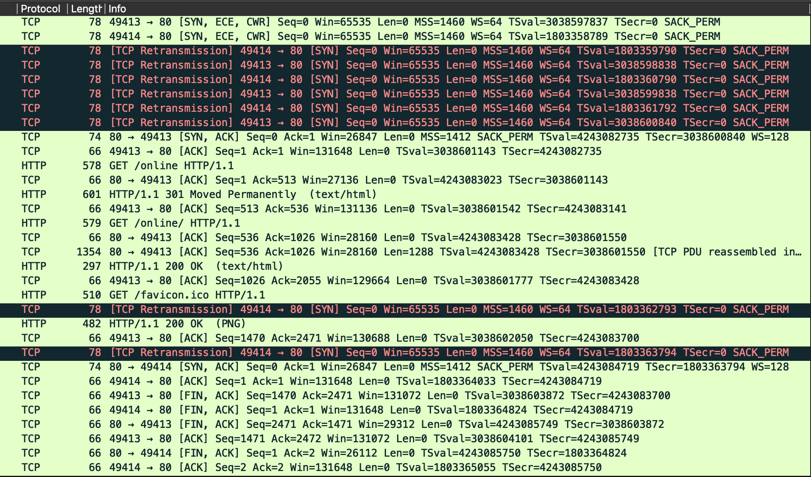
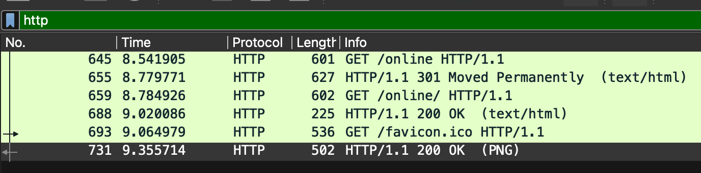
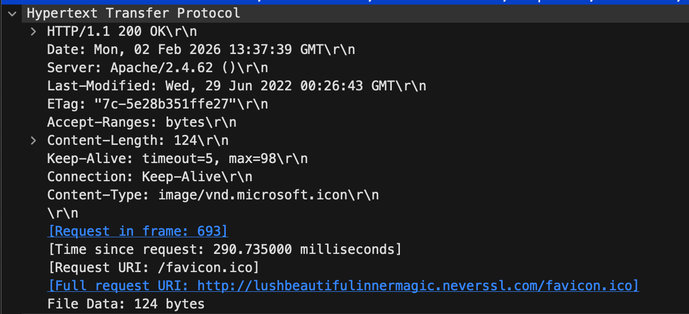
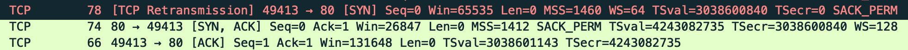
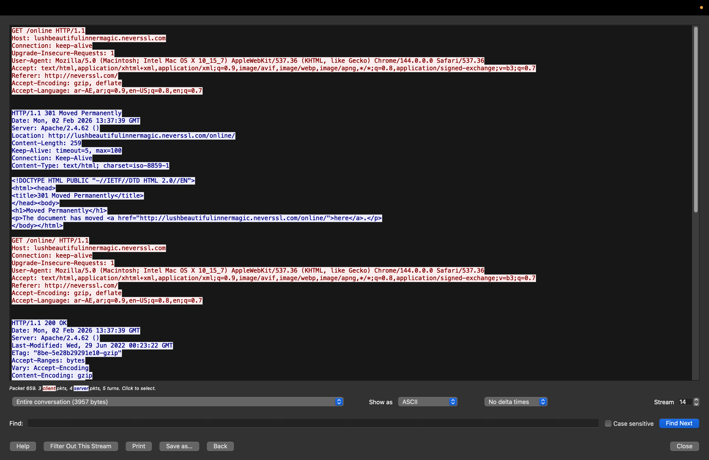
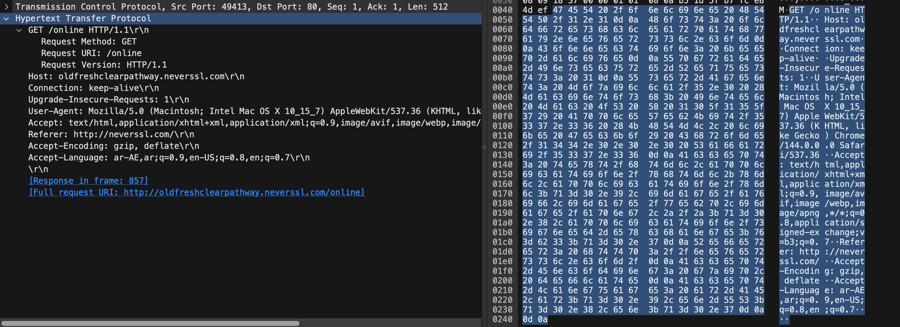
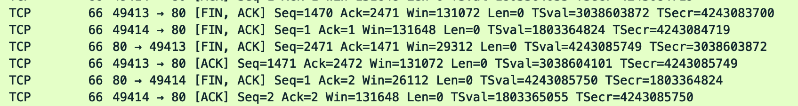
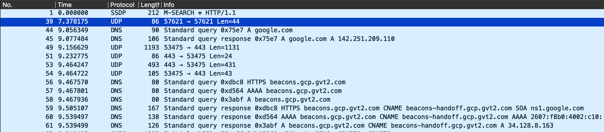
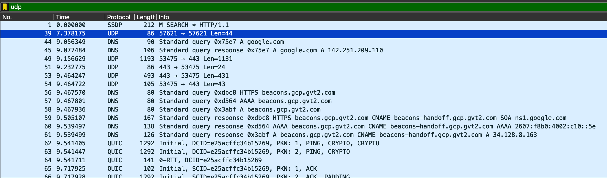
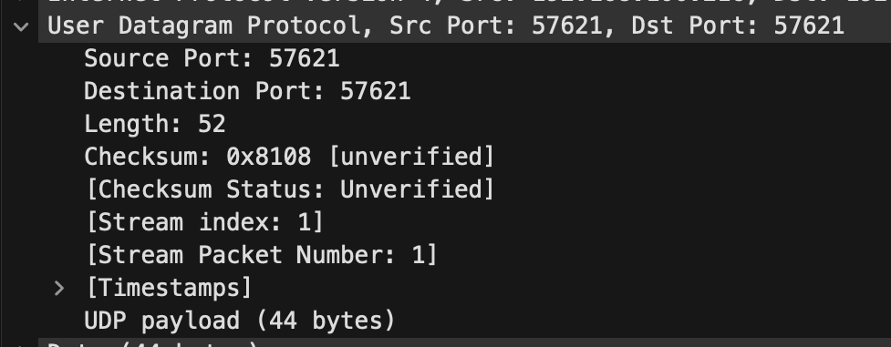

# Lab 1 - Internet Protocols

## Part 1: HTTP 

### Task 1:

Full Connection:



### Task 2:

Filtering HTTP packets:



HTTP 200 respone message:

 

## Part 2: TCP/IP 

### Task 1:

Filtering TCP packets:


### Task 2:

The TCP three-way handshake:



TCP Stream:



Observed data packets:



Connection Termination:



The connection closes using:
1. **FIN-ACK**: Client initiates close
2. **ACK**: Server acknowledges
3. **FIN-ACK**: Server also closes
4. **ACK**: Client acknowledges

## Part 3: UDP

### Task 1:

I used ```nslookup google.com``` in terminal because DNS lookup uses UDP

Full connection:



### Task 2:

Filtered UDP Packets:



UDP Header: 



## Part 4: Comparing TCP and UDP

### Task 1: Fill in the following table and provide reasons.

| Feature | TCP/UDP | Reasons |
|---------|-----------|----------|
| **Reliability and Connection Establishment** | TCP | TCP is connection-oriented and establishes a reliable connection through the three-way handshake (SYN, SYN-ACK, ACK). It guarantees delivery of data by using acknowledgments and retransmissions for lost packets. UDP is connectionless and does not establish a connection or guarantee delivery. |
| **Data Integrity and Ordering** | TCP | TCP ensures data integrity using checksums and guarantees that data arrives in the correct order using sequence numbers. If packets arrive out of order, TCP reorders them. UDP provides only basic checksum error detection and does not guarantee packet ordering - packets may arrive out of order or not at all. |

---

### Task 2: Identify the use Cases and Performance of TCP and UDP.

| | TCP | UDP |
|---|-----|-----|
| **Use cases** | • Web browsing (HTTP/HTTPS)<br>• Email (SMTP, IMAP, POP3)<br>• File transfers (FTP, SFTP)<br>• Remote access (SSH, Telnet)<br>• Database queries<br>• Any application requiring reliable data delivery | • Live streaming (video/audio)<br>• Online gaming<br>• VoIP (Voice over IP)<br>• DNS queries<br>• IoT sensor data<br>• Video conferencing<br>• Any application where speed > reliability |
| **Performance** | **Slower but reliable:**<br>• Higher overhead due to connection establishment<br>• Acknowledgments and retransmissions add latency<br>• Flow control and congestion control prevent network overload<br>• Guaranteed delivery increases processing time<br>• Best for applications where accuracy matters more than speed | **Faster but unreliable:**<br>• Minimal overhead (no handshake, no acknowledgments)<br>• Lower latency - data sent immediately<br>• No retransmissions means less delay<br>• No flow/congestion control<br>• Smaller header size (8 bytes vs 20+ bytes)<br>• Best for real-time applications where some data loss is acceptable |
